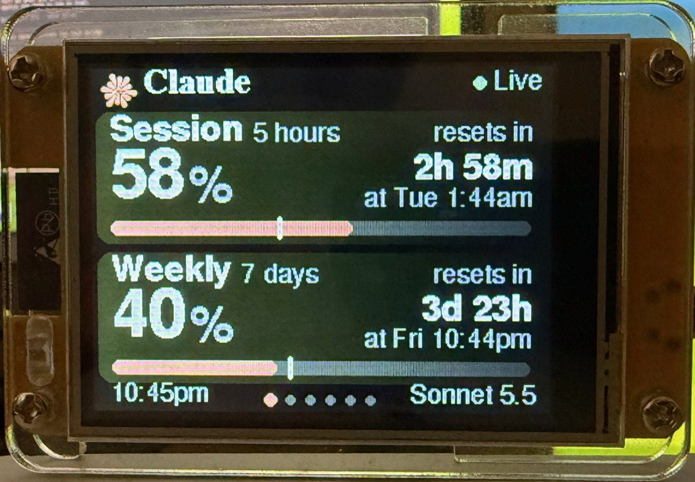
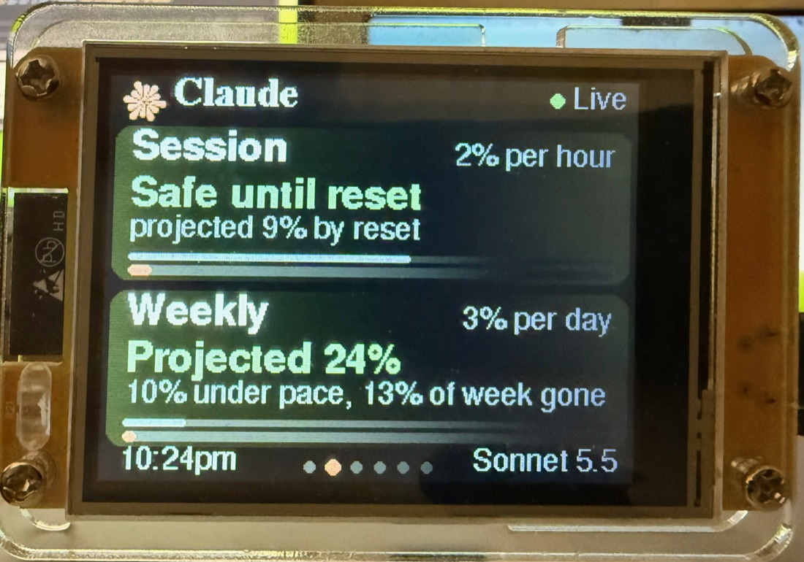
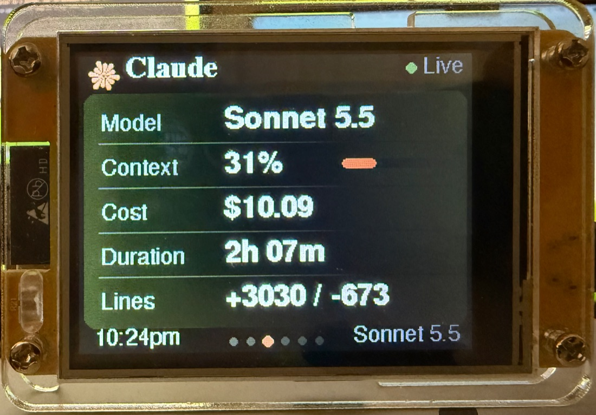
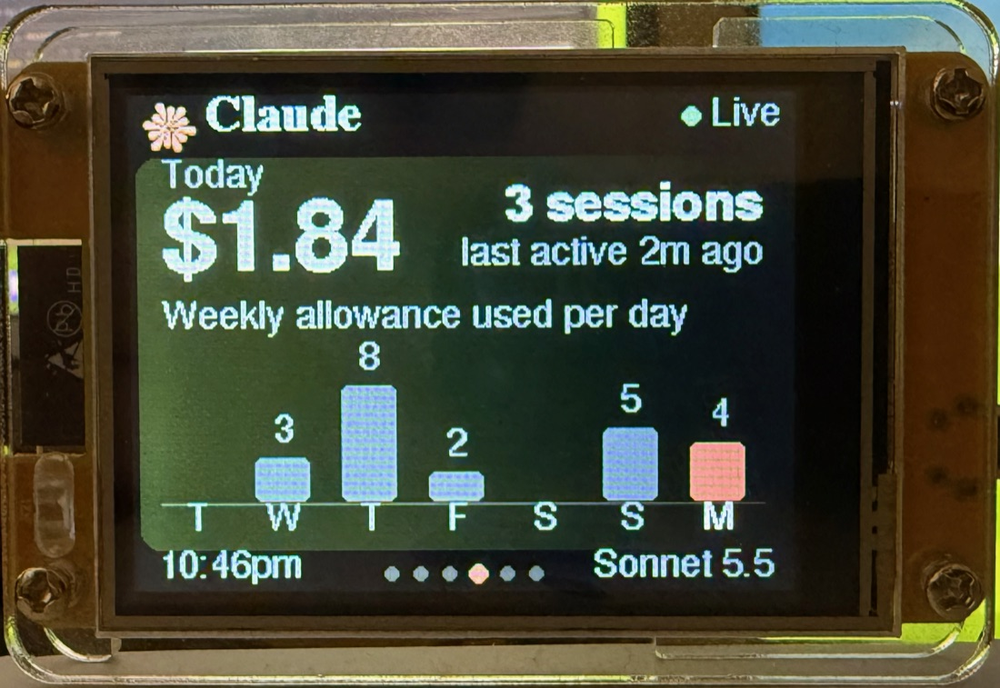
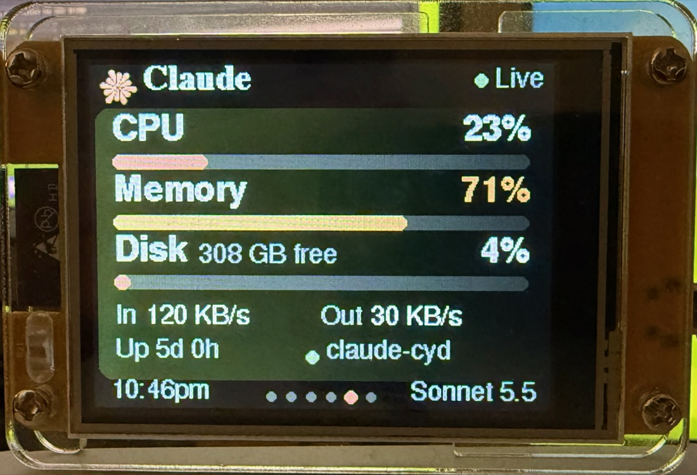
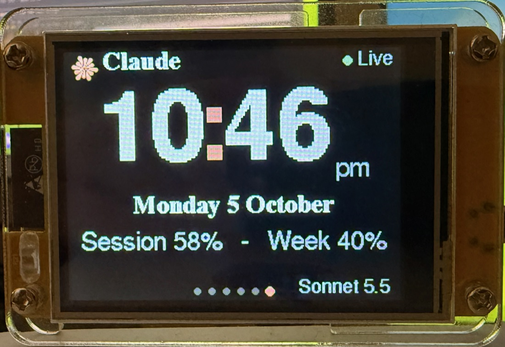

# CYD Usage Monitor

A 320x240 landscape dashboard for the ESP32 "Cheap Yellow Device" (ESP32-2432S028)
that shows your Claude usage at a glance: time left in the current 5-hour session, how
much of the session and weekly allowance you've used, and when each resets. When Claude
is quiet it turns into an ambient Mac display (clock, system health, activity history).

Unofficial hobby project, not affiliated with or endorsed by Anthropic. It reads usage
figures that Claude Code already exposes to its statusLine; see [Branding](#branding).

```
Claude Code -> statusline.py -> state.json + history.jsonl ->
   bridge.py (launchd; + Mac stats, idle/night/alert rules) -> USB serial -> CYD
```

## Screenshots
<table>
  <tr>
    <td align="center"><br><sub><b>Home</b>: usage, reset countdowns, pace marker</sub></td>
    <td align="center"><br><sub><b>Forecast</b>: will you hit the limit?</sub></td>
    <td align="center"><br><sub><b>Info</b>: model, context, cost, lines</sub></td>
  </tr>
  <tr>
    <td align="center"><br><sub><b>Activity</b>: today and the last 7 days</sub></td>
    <td align="center"><br><sub><b>Health</b>: your Mac at a glance</sub></td>
    <td align="center"><br><sub><b>Clock</b>: ambient mode</sub></td>
  </tr>
</table>

<sub>Photos of the Claude-style build showing sample data from the built-in test feed (`host/fake_feed.py mid`), not real usage. Tap right / left to cycle pages; the Claude look is labelled unofficial, see [Branding](#branding).</sub>

## Requirements
- A CYD (ESP32-2432S028, 2.8" 320x240 ILI9341 with XPT2046 touch) and a USB cable
- macOS (the host side uses launchd) with Python 3
- [PlatformIO](https://platformio.org) (`pip install platformio`)
- Claude Code whose statusLine JSON includes `rate_limits` (it did for the author's
  subscription login; API-key setups may not have it)

Tested on one board. Other CYD variants may need display flags changed; see the comment in
`platformio.ini`.

## Quick start
1. **Back up the original firmware** (so you can restore it):
   `esptool read-flash 0x0 0x400000 backup.bin --port /dev/cu.usbserial-*`
   (use `--baud 115200`; faster rates are flaky on many CH340 boards).
2. **Flash the firmware:** `pio run -t upload --upload-port /dev/cu.usbserial-*`
   (neutral look; see [Branding](#branding) for the Claude-style one)
3. **Install the host side:** `host/install.sh` installs the bridge as a launchd agent
   and prints the `statusLine` setting to add to `~/.claude/settings.json`.
4. On first boot the CYD asks you to touch three crosshairs to calibrate the touchscreen.

## Branding
The default build is deliberately neutral: cool dark grey, teal accent, a gauge-style mark
and "Usage" in the header. For a Claude-style look (warm palette, orange spark mark, "Claude"
wordmark) build the other environment:

```
pio run -e cyd-claude -t upload --upload-port /dev/cu.usbserial-*
```

That look borrows Anthropic's name and styling, so it is **unofficial** and labelled as such:
the device shows "Unofficial fan project - Not affiliated with Anthropic" for six seconds
at every boot, "Unofficial" on the Settings page, and the build prints a notice.
"Claude" and its logo are Anthropic trademarks; the spark here is an approximation drawn in
code, not their artwork. Use the Claude look for your own device, and keep the label if you
share builds or photos. Change the header text of either look with
`-DBRAND_NAME='"Your text"'` in `build_flags`.

## Pages (tap right / left half to cycle)
Home (session + weekly) - Forecast - Info - Activity - Health - Clock

| Gesture | Action |
|---|---|
| Tap right / left half | Next / previous page |
| Tap clock (bottom-left) | Toggle "resets in" vs "resets at" |
| Long-press (~1 s) | Settings: brightness, auto-dim, 12/24 h, auto-switch, recalibrate |
| Tap while dimmed | Wake only |
| Tap an alert | Dismiss it (stays quiet for 30 min) |

On Home, the pale tick on each bar marks how much of the window has elapsed; fill
ahead of the tick means you are burning faster than pace.

**Auto-switch:** when Claude has been quiet for `idle_min` minutes (and the screen
hasn't been touched for 30 s) it rotates Clock -> Health -> Activity, and snaps back to
Home as soon as Claude usage changes. A touch takes over. Toggle in Settings.

**Night:** between the `night` times the screen dims to minimum; a touch or a new alert
lights it for a minute.

**Alerts** take over the whole screen: session or week near the limit, low disk space,
or a monitored service down.

## Configuration
`~/.claude-cyd/config.json` (created by `install.sh`, reloaded every 30 s, no reflash):
```json
{ "idle_min": 10,
  "night": ["23:00", "07:00"],
  "services": ["com.user.claude-cyd"],
  "alerts": { "sess": 90, "week": 95, "disk_free_pct": 10 } }
```
`night: null` disables night mode. `services` are launchd labels (`system/<label>` for daemons).

## Updating
- Firmware: stop the bridge (`launchctl bootout gui/$(id -u)/com.user.claude-cyd`; only one
  process can hold the serial port), then `pio run -t upload`. The port name can change
  between plug-ins; check `ls /dev/cu.usbserial*`.
- Host: re-run `host/install.sh` after editing anything in `host/`.
- Host tests: `python3 -m unittest discover -s host/tests`
- Firmware tests (no board needed): `pio test -e native`. They cover frame parsing, formatting,
  the forecast and scene maths, touch calibration and serial line assembly, built from the
  display-free sources in `src/` with the small Arduino shim in `test/shim/`.

## Frame format (bridge -> CYD, one JSON line every ~5 s)
`t, tz` (clock) - `age, s, w, m, c, cost, dur, la, lr` (Claude state; s/w = `{p, r}` percent and
reset epoch) - `auto, night` (flags) - `al` (alert codes `sess|week|disk|svc`) -
`sys` (`cpu, mem, disk, free, up, rx, tx, svc[], svn[]`) - `act` (`today, n, last, days[7]`).

## Handshake
The bridge only sends data to a port that proves it is the CYD. On connecting it writes
`{"probe":1}` and waits up to 8 s for the firmware's `{"cyd":1}`; a port that doesn't answer
is left alone for 15 s (logged once) and the next one is tried. So a second USB-serial
adapter never receives your usage. Firmware flashed before this was added doesn't answer:
reflash it, or run the bridge with `--no-handshake`.

## Notes
- Claude data only changes on API responses; "Live" means the feed is alive, not that the
  figures are up to the second. A lower weekly/session reading within the same window is a
  stale session racing a fresh one and is ignored (logged in `~/.claude-cyd/regress.log`).
- The 7-day Activity chart (weekly allowance used per day) fills in over a week; history
  starts when `statusline.py` first runs and is kept 14 days in `history.jsonl`.
- The ESP32 reboots when the bridge connects (macOS toggles reset); it recovers within 5 s.
- On the author's panel the right edge is not fully visible, so everything keeps a 4 px margin.
- Test screens without Claude: `python3 host/fake_feed.py SCENARIO` (low, mid, high, limit,
  expired, nodata, idle, night, alert-sess, alert-disk, alert-svc; needs `pyserial`).
- Logs in `~/.claude-cyd/`: `bridge.log`, `missing.log` (windows Claude Code omitted), `regress.log`.
- To uninstall: `launchctl bootout gui/$(id -u)/com.user.claude-cyd`, delete
  `~/Library/LaunchAgents/com.user.claude-cyd.plist` and `~/.claude-cyd`, and remove the
  `statusLine` entry from `~/.claude/settings.json`.

## Licence
MIT, see [LICENSE](LICENSE). This repo contains only original code; the libraries below are
downloaded by PlatformIO / pip at build or install time and keep their own licences:

| Dependency | Licence |
|---|---|
| [TFT_eSPI](https://github.com/Bodmer/TFT_eSPI) (incl. its bundled Adafruit GFX fonts) | FreeBSD / BSD |
| [XPT2046_Touchscreen](https://github.com/PaulStoffregen/XPT2046_Touchscreen) | MIT |
| [ArduinoJson](https://arduinojson.org) | MIT |
| [pyserial](https://github.com/pyserial/pyserial), [psutil](https://github.com/giampaolo/psutil) | BSD |

If you distribute a compiled firmware image rather than this source, it embeds those
libraries and fonts, so include their notices with it.
